# SIT725 Group 7 — Campus Marketplace (Individual HD Docker Submission)

A web-based marketplace built for university students to buy and sell second-hand items (textbooks, electronics, furniture, etc.) within their own campus community.

Built as part of the SIT725 unit project (Deakin University). This repository is an individually Dockerised copy of the group project, submitted for the SIT725 HD Docker task by **Sony Nguyen (Student ID: s225090845)**.

---

## Tech Stack

- **Backend**: Node.js, Express
- **Database**: MongoDB (Mongoose)
- **Auth**: JWT + bcrypt
- **File uploads**: Multer
- **Containerisation**: Docker, Docker Compose

---

## Project Structure

```
├── Dockerfile                          # Container build definition (repo root)
├── docker-compose.yml                  # App + MongoDB orchestration
├── .dockerignore
├── backend/
│   ├── config/
│   │   └── db.js                       # MongoDB connection setup
│   ├── controllers/
│   │   ├── authController.js
│   │   ├── listingController.js
│   │   └── studentController.js        # HD identity endpoint logic
│   ├── models/
│   │   ├── Users.js
│   │   └── listing.js
│   ├── middleware/
│   │   └── authMiddleware.js
│   ├── routes/
│   │   ├── authRoutes.js
│   │   ├── listingRoutes.js
│   │   └── studentRoutes.js            # HD identity endpoint route
│   ├── .env.example                    # Template — copy to .env before running
│   ├── package.json
│   └── server.js
└── frontend/
    └── public/                         # Static frontend, served by Express
```

---

## Environment Variables

`backend/.env` is **not** committed to this repository. Before running the application, copy the template and fill it in:

```bash
cp backend/.env.example backend/.env
```

| Variable     | What to Put                                | Description                                                                                                                                                             |
| ------------ | ------------------------------------------ | ----------------------------------------------------------------------------------------------------------------------------------------------------------------------- |
| `PORT`       | `3000`                                     | Port the server listens on inside the container.                                                                                                                        |
| `MONGO_URI`  | `mongodb://mongo:27017/campus-marketplace` | Must use the `mongo` service hostname, not `localhost` — inside a container, `localhost` refers to that container itself, not the database container.                   |
| `JWT_SECRET` | Any random string (see command below)      | Used only to sign JWTs within this app. There is no "correct" value to match — any string works identically, since the same app both signs and verifies its own tokens. |

Generate a `JWT_SECRET` value:

```bash
node -e "console.log(require('crypto').randomBytes(32).toString('hex'))"
```

---

## Getting Started

### Prerequisites

- Docker Desktop (or Docker Engine + Docker Compose)

### Running With Docker
1. Open Terminal

2. Clone the repository:

   ```bash
   git clone https://github.com/sonyrich/SIT725_HD_Campus_Marketplace.git
   ```

   ```bash
   cd SIT725_HD_Campus_Marketplace/backend
   ```
   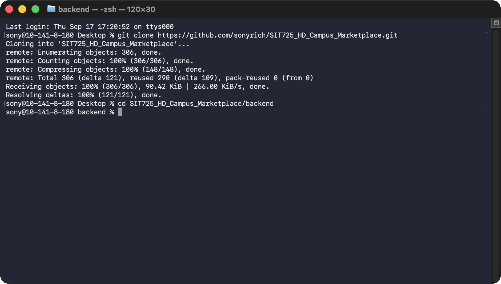

3. Inside the backend folder, copy the environment template and fill in your own values:

   ```bash
   cp .env.example .env
   ```
   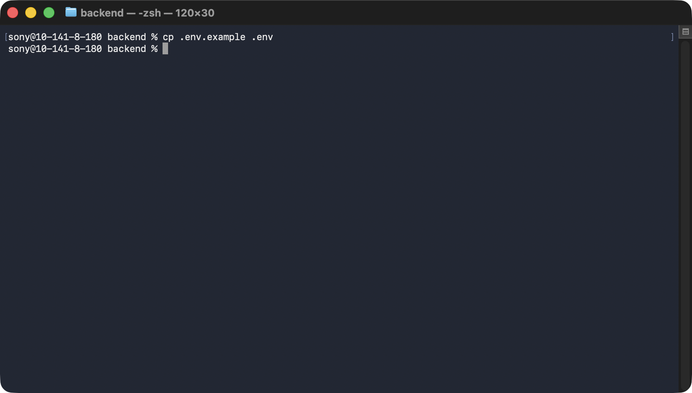
   
   See [Environment Variables](#environment-variables) above for what each value means.

4. Return to the repository root `cd ..` , build and start the full stack (app + MongoDB):

   ```bash
   cd ..
   ```
   
   ```bash
   docker compose up --build
   ```
   
   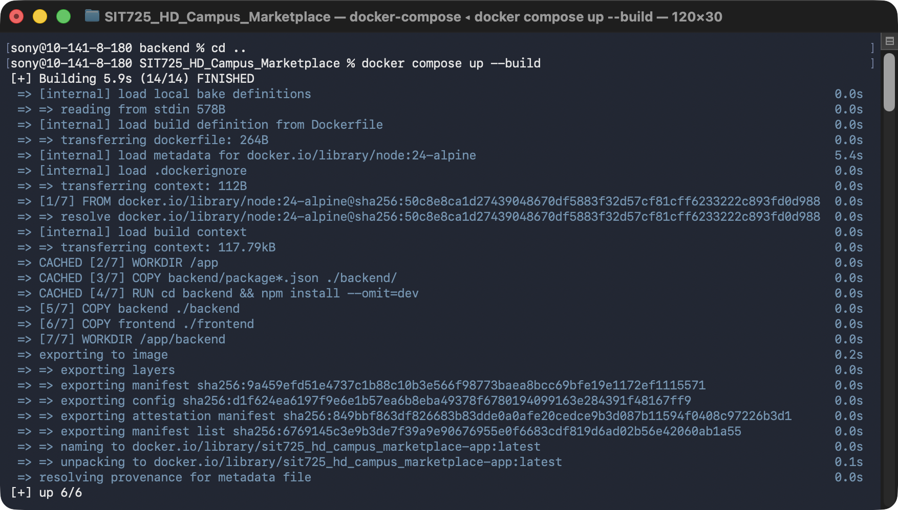

5. Wait for these two lines in the terminal, confirming both services are up:

   ```
   APP is running on port 3000
   Mongoose Connected
   ```
6. Check the Docker compose is running by running the command:

   ```bash
   docker compose ps
   ```
   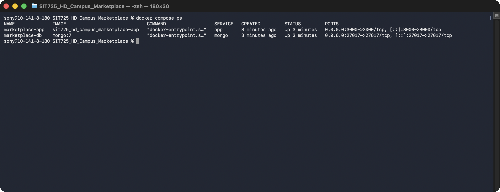

   Or checking in the Docker Desktop, Container and Images tab:
   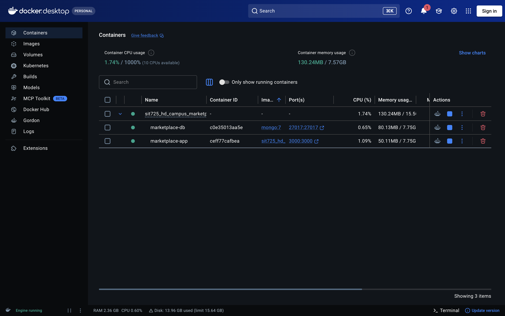
   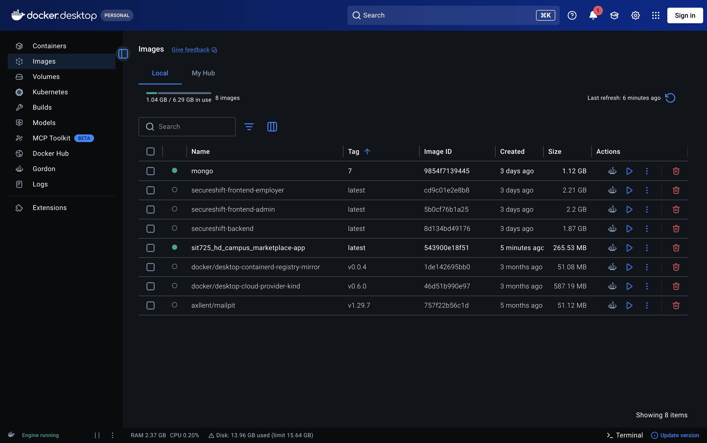

8. Open `http://localhost:3000` in a browser. The full application (frontend + backend + database) is now running.
   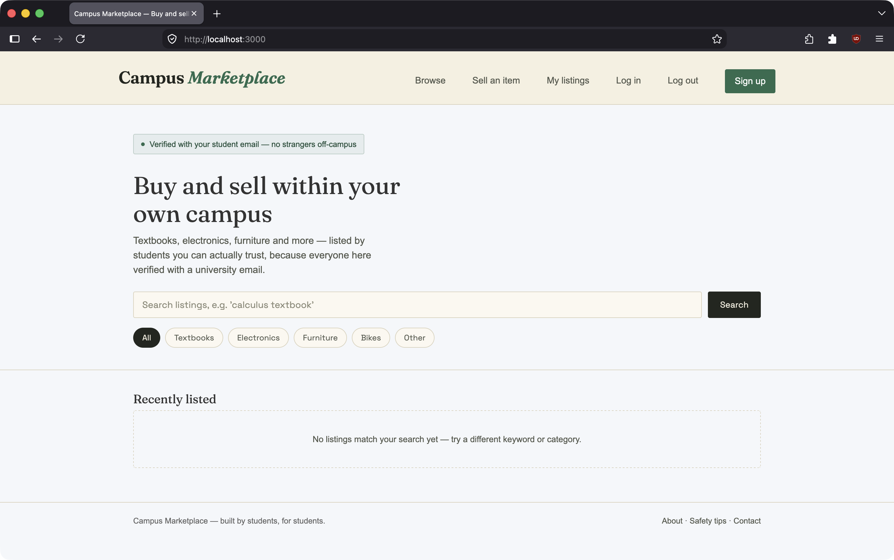

9. To stop the containers:

   ```bash
   docker compose down
   ```
   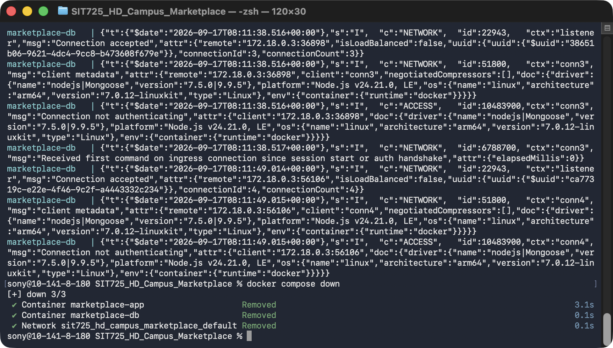

   Add `-v` to also delete the MongoDB data volume for a fully clean reset:

   ```bash
   docker compose down -v
   ```
   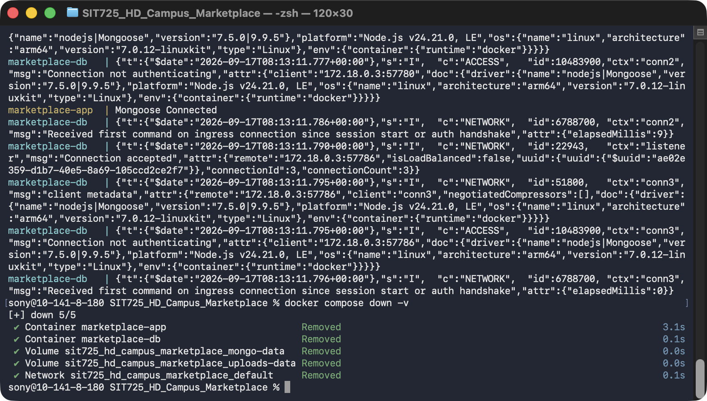
   
### Troubleshooting

If your containers stop working (for example, if MongoDB stops responding), reset Docker Desktop back to its default settings:

1. Right-click the Docker Desktop icon (menu bar on macOS, system tray on Windows)
   and click **Troubleshoot**.
   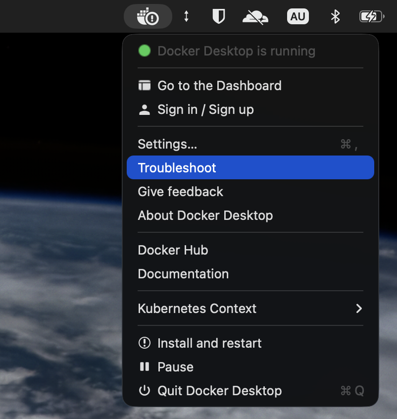

2. In Docker Desktop, click **Reset to factory defaults**.
   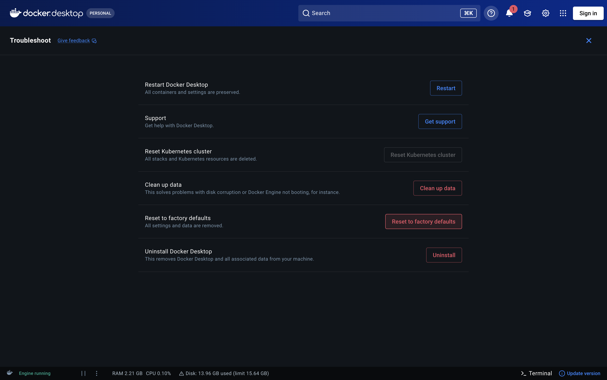

3. Click **Yes, reset anyway** to confirm.
   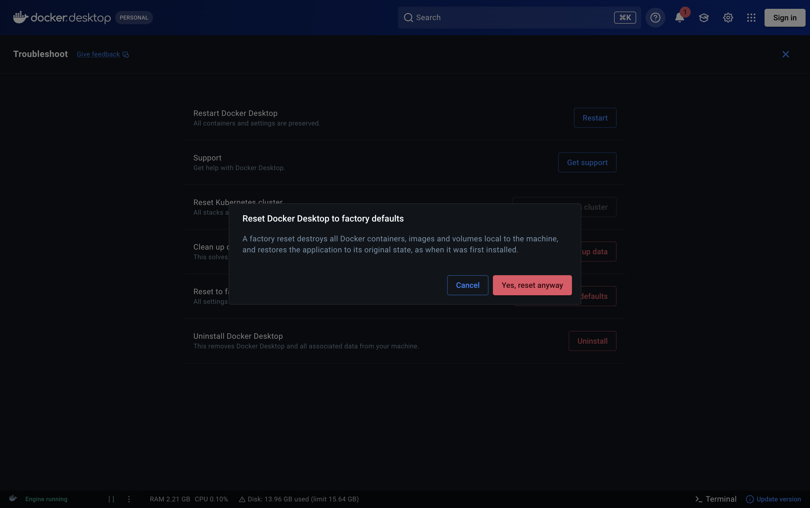

4. Wait for Docker Desktop to finish resetting before trying again.
   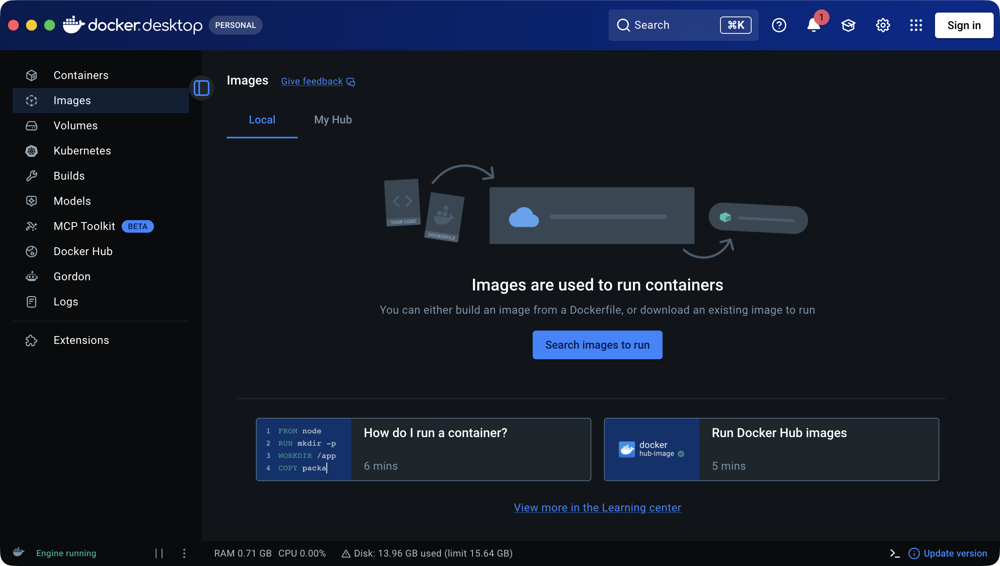


---

## Student Identity Endpoint

- **URL**: `http://localhost:3000/api/student`
- **Method**: `GET`
- **Expected response**:

  ```json
  {
    "name": "Sony Nguyen",
    "studentId": "s225090845"
  }
  ```

---

## Key API Endpoints

| Method | Endpoint             | Description                                                                                                     |
| ------ | -------------------- | --------------------------------------------------------------------------------------------------------------- |
| `GET`  | `/api/student`       | Returns the submitter's name and student ID.                                                                    |
| `POST` | `/api/auth/register` | Creates a new user account. Requires `fullName`, `email`, `password`, `studentID`.                              |
| `POST` | `/api/auth/login`    | Authenticates an existing user. Requires `email`, `password`. Returns a JWT and stored user details on success. |
| `GET`  | `/api/listings`      | Retrieves marketplace listings.                                                                                 |

---

## Verifying Database Integration

To confirm signup/login are writing to the containerized MongoDB instance rather than failing silently, run the app first, create an account through the UI or via the register endpoint, then query the database directly:

```bash
docker exec -it marketplace-db mongosh campus-marketplace --eval "db.users.find().pretty()"
```

The Mongo container name is fixed to `marketplace-db` by `container_name: marketplace-db` in `docker-compose.yml`, so there's no need to look it up with `docker ps` — the command above will always work as long as the service name in the compose file isn't changed.

A successful signup shows a user document with a bcrypt-hashed password (starting with `$2b$`). If you then log in with `POST /api/auth/login` using the same email and password, you should receive a `200 OK` response containing a JWT token and the same user's stored details.

---

## Notes For Markers

This is an **individual HD submission**. The application logic is a group project (SIT725 Group 7), but the Docker containerisation, `/api/student` endpoint, and this README were completed individually by Sony Nguyen (s225090845).
